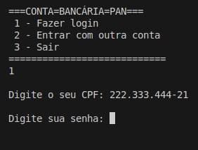
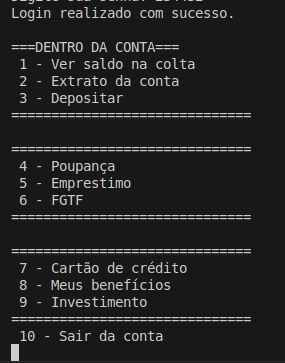
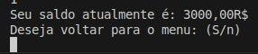
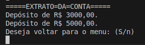
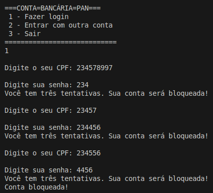
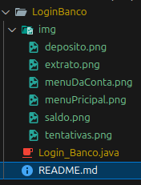

# 📁 LoginBanco - Sistema Simples de Login Bancário em Java

### Um projeto Java que simula um sistema bancário básico com autenticação de usuário, visualização de saldo, extrato e depósitos.

## Funcionalidades Principais

**Autenticação Segura**

- Login com CPF e senha pré-definidos

- Bloqueio após 3 tentativas falhas

**Operações Bancárias**

- Consulta de saldo

- Visualização de extrato

- Depósito em conta

**Menu Interativo**

- Interface em console com opções numeradas

- Navegação entre funcionalidades

## Estrutura do Código

```Bash copy Download
public class Login_Banco {
    // Credenciais fixas (para demonstração)
    private static final String CPF_CONTA = "222.333.444-21";
    private static final String SENHA_CONTA = "234432";
    
    // Dados da conta
    private static double saldo = 0.0;
    private static ArrayList<String> extrato = new ArrayList<>();
    
    // Métodos principais:
    // - main(): Menu principal
    // - entrarNaConta(): Menu de operações
    // - verSaldoNaConta(), extratoDaConta(), fazerDeposito()
}
```

## Como Executar

1. Compile o arquivo Java:

```Bash copy Download
javac LoginBanco/Login_Banco.java
```

2. Execute o programa:

```Bash copy Download
java LoginBanco.Login_Banco
```

#

## Telas do Sistema

**Menu Principal**




**Menu Da Conta**



**Depósitar**


**Ver Saldo Da Conta**



**Ver extrato**



**USUÁRIO TERÁ TRÊS TENTATIVAS SE DIGITAR CPF OU SENHA ERRADA, A CONTA É BLOQUEIDA**



#

## Limitações Atuais

- Credenciais hardcoded (apenas uma conta)

- Funcionalidades de poupança, empréstimo etc. não implementadas

- Sem persistência de dados (reinicia a cada execução)


## Melhorias Futuras

- Conexão com banco de dados

- Sistema de cadastro de novas contas

- Implementar todas as opções do menu

- Interface gráfica

 

Desenvolvido por PEDRO OLIVEIRA DO CARMO | Java 11+ | 2023